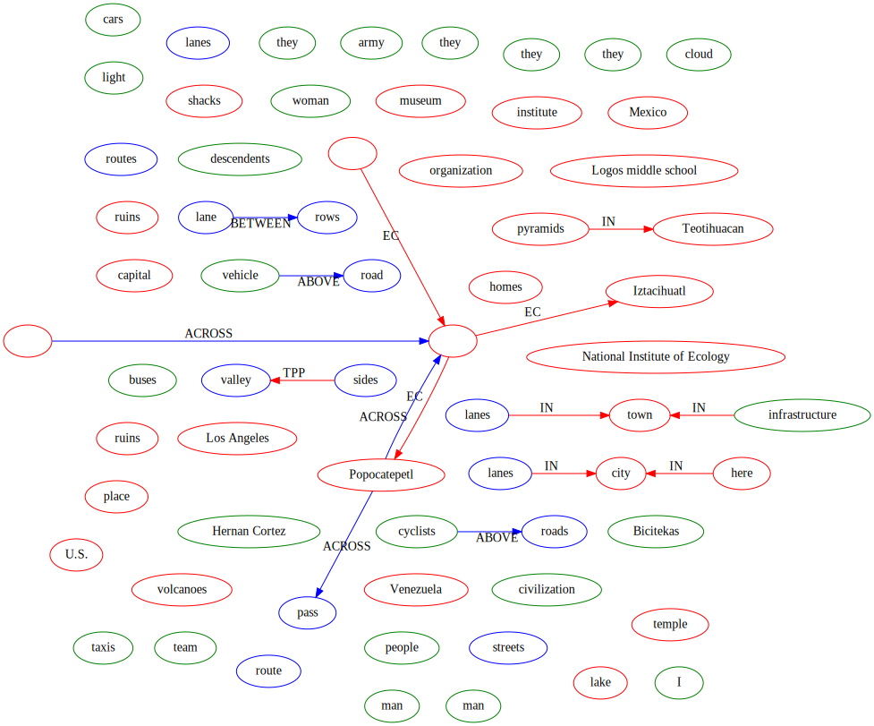

# Bicycles.xml
## Wie oft kommen welche PoS-Tags vor?
| Count | Tag |
| -- | -- |
|211 | NOUN |
|133 | VERB |
|128 | PUNCT |
|111 | DET |
|106 | ADP |
|79 | ADJ |
|74 | PRON |
|45 | PROPN |
|45 | ADV |
|36 | CCONJ |
|35 | AUX |
|22 | PART |
|19 | NUM |
|12 | SPACE |
|12 | SCONJ |
|1 | SYM |
|1 | X |

## Wie viele [SpatialEntities,...] gibt es
| Count | Entity |
| -- | -- |
|1070 | TOKEN |
|67 | METALINK |
|56 | SPATIAL_ENTITY |
|52 | PLACE |
|49 | SENTENCE |
|39 | MOVELINK |
|36 | MOTION |
|27 | QSLINK |
|17 | PATH |
|17 | SPATIAL_SIGNAL |
|12 | MOTION_SIGNAL |
|10 | NONMOTION_EVENT |
|7 | OLINK |
|2 | MEASURE |
|2 | MLINK |

## Wie oft kommen welche QsLink Typen vor? Länge
| Count | Typ |
| -- | -- |
|18 | IN |
|7 | EC |
|1 | TPP |
|1 | DC |

## Verteilung der Satzlänge graphisch darstellen, länge zwischen a und b
| Count | a | b |
| -- | -- | -- |
|6 | 130 | 140 |
|6 | 150 | 160 |
|6 | 60 | 70 |
|4 | 50 | 60 |
|4 | 120 | 130 |
|3 | 100 | 110 |
|3 | 30 | 40 |
|3 | 40 | 50 |
|2 | 180 | 190 |
|2 | 80 | 90 |
|2 | 90 | 100 |
|2 | 70 | 80 |
|1 | 310 | 320 |
|1 | 10 | 20 |
|1 | 190 | 200 |
|1 | 110 | 120 |
|1 | 160 | 170 |
|1 | 140 | 150 |

## Welche Links (QSLinks, OLinks) werden von welchen Präpositionen getriggert
| Count | Link Typ | Präposition |
| -- | -- | -- |
|10 | QSLINK | in |
|2 | QSLINK | on |
|2 | QSLINK | where |
|2 | OLINK | on |
|1 | QSLINK | At |
|1 | QSLINK | on top |
|1 | QSLINK | at |
|1 | OLINK | between |
|1 | OLINK | on top |

## Welches sind die fünf häufigsten „MOTION“ Verben 
| Count | verb |
| -- | -- |
|5 | visited |
|3 | ride |
|3 | biking |
|2 | biked |
|2 | rode |

## Graph Vis

