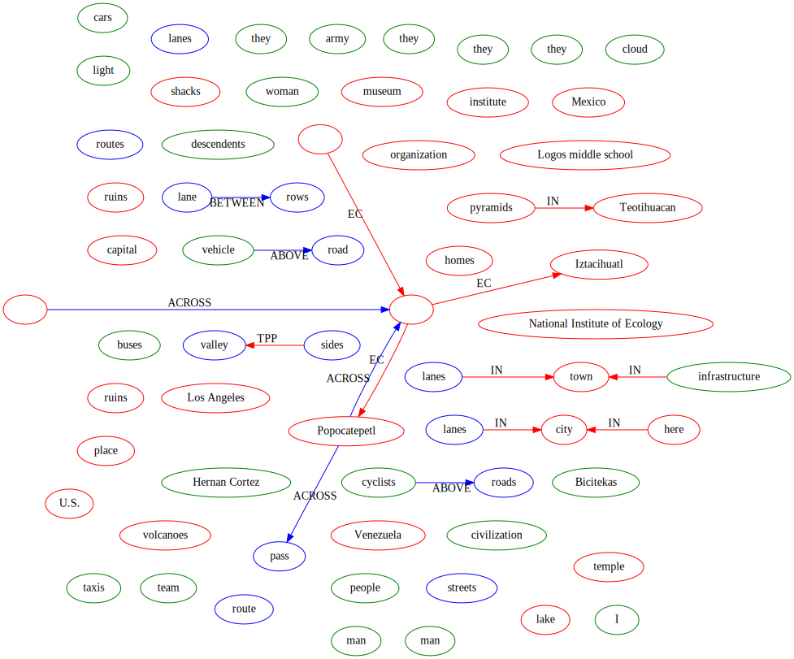
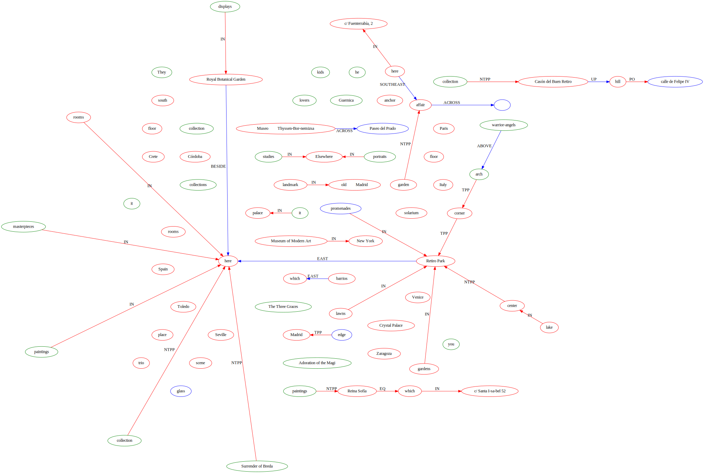

# Abgabe
Das Programm `main.py` schreibt die Ergebnisse im Markdown Format in den Output Ordner.

# Laufbedingungen
`networkx`  
`spacy`  
`Python 3.7+`  da dataclasses verwendet werden  
graphviz muss installiert sein(glaube ich...)  
Das Betriebsystem sollte nicht windows sein, denn in diesem Fall gibt es den text einfach nur aus und speichert ihn nicht


# Infos
Die Daten können im Json Format gespeichert werden und werden dies aus, sie liegen Unter den folgenden links  
[Highlights_of_the_Prado_Museum.xml.json](output/Highlights_of_the_Prado_Museum.xml.json)  
[Bicycles.xml.json](output/Bicycles.xml.json)

Das Programm speichert die Analyse in Markdown Dateien in diesen finden man auch den Graph. Man findet diese an folgenen Orten

[Highlights_of_the_Prado_Museum](output/Highlights_of_the_Prado_Museum.xml.md)  
[Bicycles](output/Bicycles.xml.md)

Hier die Farben die, die Kanten und Knoten im Graphen haben

```python
color_table = {
    "PLACE": "red",
    "SPATIAL_ENTITY": "green",
    "PATH": "blue",
    "NONMOTIONEVENT": "orange",

    "QSLINK": "red",
    "OLINK": "blue",
    }
```


# Bicycles.xml
## Wie oft kommen welche PoS-Tags vor?
| Count | Tag |
| -- | -- |
|211 | NOUN |
|133 | VERB |
|128 | PUNCT |
|111 | DET |
|106 | ADP |
|79 | ADJ |
|74 | PRON |
|45 | PROPN |
|45 | ADV |
|36 | CCONJ |
|35 | AUX |
|22 | PART |
|19 | NUM |
|12 | SPACE |
|12 | SCONJ |
|1 | SYM |
|1 | X |

## Wie viele [SpatialEntities,...] gibt es
| Count | Entity |
| -- | -- |
|1070 | TOKEN |
|67 | METALINK |
|56 | SPATIAL_ENTITY |
|52 | PLACE |
|49 | SENTENCE |
|39 | MOVELINK |
|36 | MOTION |
|27 | QSLINK |
|17 | PATH |
|17 | SPATIAL_SIGNAL |
|12 | MOTION_SIGNAL |
|10 | NONMOTION_EVENT |
|7 | OLINK |
|2 | MEASURE |
|2 | MLINK |

## Wie oft kommen welche QsLink Typen vor? Länge
| Count | Typ |
| -- | -- |
|18 | IN |
|7 | EC |
|1 | TPP |
|1 | DC |

## Verteilung der Satzlänge graphisch darstellen, länge zwischen a und b
| Count | a | b |
| -- | -- | -- |
|6 | 130 | 140 |
|6 | 150 | 160 |
|6 | 60 | 70 |
|4 | 50 | 60 |
|4 | 120 | 130 |
|3 | 100 | 110 |
|3 | 30 | 40 |
|3 | 40 | 50 |
|2 | 180 | 190 |
|2 | 80 | 90 |
|2 | 90 | 100 |
|2 | 70 | 80 |
|1 | 310 | 320 |
|1 | 10 | 20 |
|1 | 190 | 200 |
|1 | 110 | 120 |
|1 | 160 | 170 |
|1 | 140 | 150 |

## Welche Links (QSLinks, OLinks) werden von welchen Präpositionen getriggert
| Count | Link Typ | Präposition |
| -- | -- | -- |
|10 | QSLINK | in |
|2 | QSLINK | on |
|2 | QSLINK | where |
|2 | OLINK | on |
|1 | QSLINK | At |
|1 | QSLINK | on top |
|1 | QSLINK | at |
|1 | OLINK | between |
|1 | OLINK | on top |

## Welches sind die fünf häufigsten „MOTION“ Verben 
| Count | verb |
| -- | -- |
|5 | visited |
|3 | ride |
|3 | biking |
|2 | biked |
|2 | rode |

## Graph Vis



# Highlights_of_the_Prado_Museum.xml
## Wie oft kommen welche PoS-Tags vor?
| Count | Tag |
| -- | -- |
|343 | NOUN |
|306 | PUNCT |
|289 | PROPN |
|227 | ADP |
|211 | DET |
|197 | ADJ |
|170 | SPACE |
|140 | VERB |
|75 | ADV |
|66 | AUX |
|61 | CCONJ |
|45 | PRON |
|37 | PART |
|33 | NUM |
|9 | SCONJ |
|4 | X |
|1 | SYM |

## Wie viele [SpatialEntities,...] gibt es
| Count | Entity |
| -- | -- |
|2214 | TOKEN |
|87 | PLACE |
|82 | SENTENCE |
|65 | METALINK |
|44 | SPATIAL_ENTITY |
|39 | QSLINK |
|32 | SPATIAL_SIGNAL |
|13 | NONMOTION_EVENT |
|12 | MOVELINK |
|11 | MOTION_SIGNAL |
|10 | OLINK |
|9 | MOTION |
|6 | PATH |
|2 | MEASURE |
|2 | MEASURELINK |

## Wie oft kommen welche QsLink Typen vor? Länge
| Count | Typ |
| -- | -- |
|23 | IN |
|7 | NTPP |
|3 | EQ |
|3 | TPP |
|2 | EC |
|1 | PO |

## Verteilung der Satzlänge graphisch darstellen, länge zwischen a und b
| Count | a | b |
| -- | -- | -- |
|8 | 140 | 150 |
|7 | 160 | 170 |
|7 | 150 | 160 |
|7 | 120 | 130 |
|7 | 190 | 200 |
|5 | 90 | 100 |
|5 | 80 | 90 |
|4 | 70 | 80 |
|4 | 110 | 120 |
|3 | 60 | 70 |
|3 | 210 | 220 |
|3 | 170 | 180 |
|2 | 50 | 60 |
|2 | 100 | 110 |
|2 | 260 | 270 |
|2 | 130 | 140 |
|1 | 220 | 230 |
|1 | 200 | 210 |
|1 | 0 | 10 |
|1 | 310 | 320 |
|1 | 290 | 300 |
|1 | 40 | 50 |
|1 | 320 | 330 |
|1 | 30 | 40 |
|1 | 280 | 290 |
|1 | 180 | 190 |
|1 | 230 | 240 |

## Welche Links (QSLinks, OLinks) werden von welchen Präpositionen getriggert
| Count | Link Typ | Präposition |
| -- | -- | -- |
|14 | QSLINK | in |
|4 | QSLINK | houses |
|1 | QSLINK | house |
|1 | QSLINK | inside |
|1 | QSLINK | adjacent to |
|1 | QSLINK | packed with |
|1 | QSLINK | At |
|1 | QSLINK | surmounted |
|1 | OLINK | Across |
|1 | OLINK | up |
|1 | OLINK | across from |
|1 | OLINK | alongside |
|1 | OLINK | behind |
|1 | OLINK | South­east of |
|1 | OLINK | east of |
|1 | OLINK | adjacent to |
|1 | OLINK | surmounted |
|1 | OLINK | east |

## Welches sind die fünf häufigsten „MOTION“ Verben 
| Count | verb |
| -- | -- |
|1 | go |
|1 | paddle |
|1 | fled |
|1 | went |
|1 | moved |

## Graph Vis

